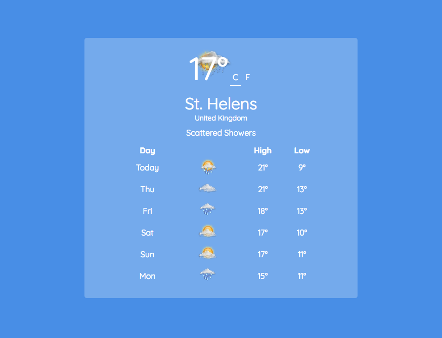

# WeatherApp
Intermediate Front End Development Project for FreeCodeCamp.

The [simpleWeather jQuery plugin](http://simpleweatherjs.com/) is used to pull in weather information for this project.

This page is intended to be functionally similar to [this example page](https://codepen.io/freeCodeCamp/full/bELRjV).

A codepen of my page can be found [here](https://codepen.io/vanillaSlice/full/OmYLwL/).

## Screenshot

